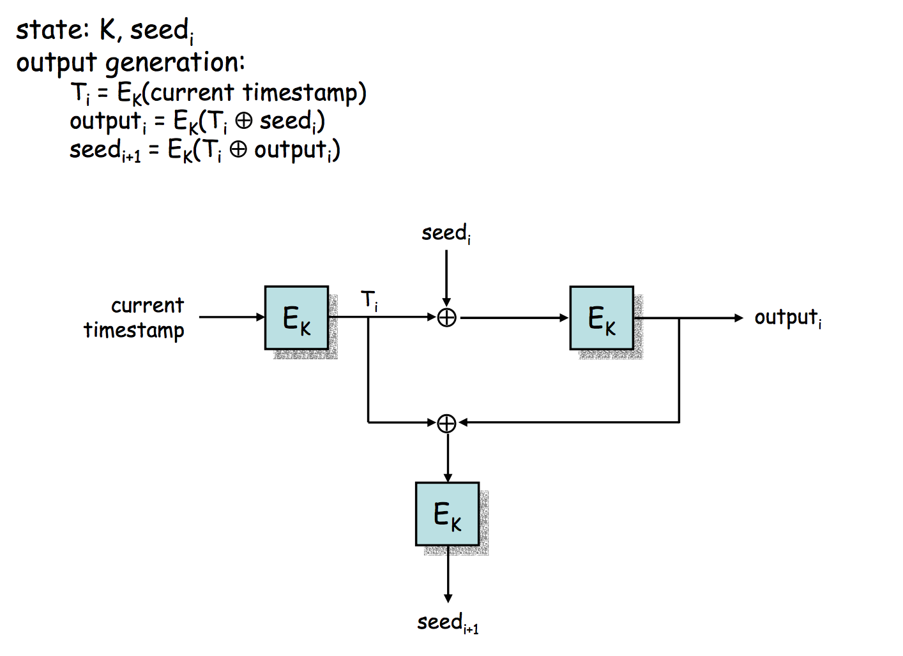
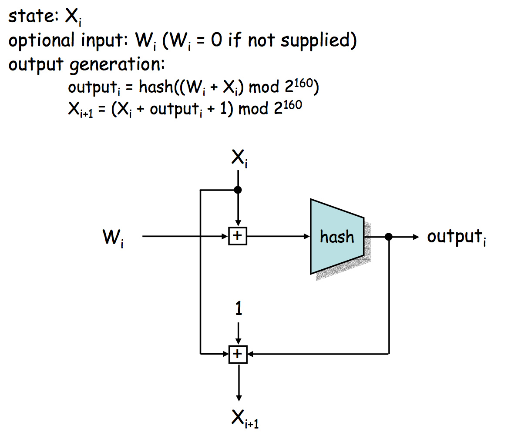

>2016年12月 5日 星期一 15时00分25秒 CST

# Pseudo-Random Number Generator 

先区别几个概念先：

1. Randomized Algorithm: Any algorithm that makes random (or pseudo-random) choices.
2. Deterministic Algorithm: An algorithm whose behavior can be predicted by the input.


**Pseudo-Random Number Generator**

A deterministic algorithm to generate a sequence of numbers with little or no discernible pattern in the numbers, 
except for broad statistical properties.

值得注意的是， PRNG 生成的数并不是真正随机的，因为它是由 a relatively small set of initial values 决定的。
这些初始值也称为 PRNG 的 seed, seed 可能包含有真正的随机值，比如 the current time in microseconds、response time to a disk seek、
or other random events to give different sequences every time it is used. 

应用： PRNGs are central in applications such as simulations (e.g. for the Monte Carlo method), electronic games and cryptography.

其实伪随机数生成器只要有两大类，
- 一类是特意构造的算法，比如
  * 线性同余生成器LCG、
  * Blum-Blum-Shub 生成器、
  * 线性移位寄存器反馈生成器 Linear Shift Register Feedback Generator
- 另外一类是基于现有的密码算法的
  - 对称分组密码
  - 非对称密码
  - 哈希函数或者消息验证码

不过现有的编程语言主要使用了下面[两类来生成随机数](http://rosettacode.org/wiki/Random_number_generator_(included))： 
1. Linear Congruential Generator (LCG), 即线性同余发生器
2. Generalized Feedback Shift Register (GFSR), 它还有个衍生出来的子类： the Mersenne twister

The last main type is where the output of one of the previous ones (typically a Mersenne twister) is fed 
through a cryptographic hash function to maximize unpredictability of individual bits. 

## 1. 特意构造的随机数生成算法
### 1.1 Linear Congruential Generator
所有的 LCG 均使用如下的公式：


* 其中， r_0 是一个 seed;
* r_1, r_2, r_3, ..., 是生成的随机数；
* a, c, m 是常数

对于 LCG, 如果选取合适的 a, c 和 m 的情况下，则可以使得生成的从 0 到 m-1 的整数呈均匀分布。
但是，LCG 生成的数字不是 cryptoraphically secure 的， 因为 r_n 和 r_{n+1} 不是相互独立的，只要知道了 r_n, 
就可以预测到 r_{n+1} 是多少🙄。 不过， LCG 还是可以用在 Miller-Rabin primality test 或者 FreeCell deals 这种简单的任务中的。

BSD libc 和 Microsoft C Runtime (MSCVRT.DLL) 就实现了 LCG, 它们使用的公式如下, 注意上面的 seed 对应这些公式中的 state_0. 

BSD formula:


* 其中， rand_n = state_n
* rand_n 的范围是 0 到 2147483647

Microsoft formula:


* 其中， rand_n = state_n / 2^{16}
* rand_n 的范围是 0 到 32767

C 语言中的实现是：
```C
#include <stdio.h>

int rand();
int rseed = 0;

inline void srand(int x)
{
  rseed = x;
}

#ifndef MS_RAND /* BSD rand */
#define RAND_MAX ((1U << 32) -1)
inline int rand()
{
  return rseed = (rseed * 1103515245 + 12345) & RAND_MAX;
}

#else /* MS rand */
#defin RAND_MAX_32 ((1U << 31) - 1)
#define RAND_MAX ((1U << 15) - 1)
inline int rand()
{
  return (rseed = (rseed * 214013 + 2531011) & RAND_MAX_32) >> 16;
}
#endif /* MS rand */
```

### 1.2 [Blum-Blum-Shub 生成器](http://diamond.boisestate.edu/~liljanab/ISAS/course_materials/BBSpresentation.pdf)
Blum prime number x: x 是素数，且 x mod 4 = 3
 

算法如下：
```golang
// Input: p and q, two big Blum prime numbers
// Output: z, pseudo-random number 
func BBS(p, q int) int {
  var n int = p * q

  // Chose s, where s>=1 && s<=n-1 && gcd(s, n)==1
  var seed int = choseseed(p, q)
  x = math.sqrt(seed) % n;
  var z int = 0
  for(int i=1; i<=n; i++)
  {
    x = math.sqrt(x) % n;
    z |= (x & 0x01) << i;
  }

  return  z
}

```

其实使用BBS还可以作为一种加密、解密方案，具体可以参看该[课程资料](http://diamond.boisestate.edu/~liljanab/ISAS/course_materials/BBSpresentation.pdf)
以及 Pascal Junod 发表的论文
[Cryptographic Secure Pseudo-Random Bits Generation : The Blum-Blum-Shub Generator](http://www.cs.miami.edu/home/burt/learning/Csc609.062/docs/bbs.pdf)


其中，秘钥是两个 Blum prime numbers, p 和 q; 公钥是 n = p * q;
- 加密：发送方Bob使用BBS算法根据 n 和随机选取的 seed ，生成的随机位序列(z1, ..., zn) 与明文(p1, ..., pn) 按位异或，便可生成密文 c1, ..., cn
    1. choose a seed, compute x0, x1, ..., xn, x_{n+1}
    2. for each i, compute ci = pi + xi mod 2
    3. 将密文c1, ..., cn 以及x_{n+1} 发送给对方Alice
- 解密：接收方Alice 收到 Bob 发过来的密文和 x_{n+1}，将会按照如下两部进行解密消息
    1. 逆序恢复x_i: xn, ..., x1
    2. 恢复明文：pi = (ci + xi) mod 2

但是，怎么从 x_{n+1}、p、q 解密出 x_n 呢？？🤔

如果想要了解背后的数论知识（涉及到 Quadratic Residues、Legendre symbol、Jacobi symbol、Fermat Little Theorem 及相关的定理），
可以看一下[Pascal Junod 的论文的第三节 The Blum-Blum-Shub Generator](http://www.cs.miami.edu/home/burt/learning/Csc609.062/docs/bbs.pdf)


### 1.3 Linear-Feedback Shift Register (LFSR)
一个反馈移位寄存器有两大部分：
- 移位寄存器
- 反馈函数

作用机制是：每次需要将移位寄存器右移一位，而最左边的位则根据反馈函数和其他bits（ The bit positions that 
affect the next state are called the taps. 称之为 taps）得到。

主要有两种线性反馈移位寄存器：
- Fibonacci LFSRs
- Galois LFSRs

二者的区别主要在于最左边的bit的生成不一样, 前者使用taps指定的bits做异或操作的结果作为最左边的那一位；
而后者是采用taps序列指定的每一位与移位寄存器做异或，然后取代taps序列中指定的bits，


#### [Mersenne Twister](https://en.wikipedia.org/wiki/Mersenne_Twister)


## 2. 基于现有密码算法的PRNG
### 2.1 基于分组密码的PRNG
其实前面在Block cipher 中的CTR 和 OFB 模式中就用到了，每种情况里， seed 由两部分组成：
- 加密秘钥值
- 没产生一个随机数分组后都要更新的V 值

对于 CTR 模式， V 的值每次加密一个分组后就加1；
而对于 OFB 模式， V 的值更新为前一个 PRNG 分组。
两种情况下，每次都是生成一个伪随机位分组（如果加密部分使用的是AES，则是128位的伪随机分组）。
这两部分可以回去参考一下之前写的笔记。

### 2.2 基于 3DES 加密的 ANSI X9.17 PRNG

ANSI_X9.17 伪随机发生器使用了 3DES 加密， 该算法主要在金融安全应用及PGP中所使用[算法流程](http://www.hit.bme.hu/~buttyan/courses/Revkomarom/prng.pdf).

ANSI_X9.17 PRNG 的算法和工作流程如下图所示，其中 K 是加密算法 3DES 的秘钥




## 3. 基于哈希函数的 PRNG
### 3.1 DSA PRNG
DSA PRNG 是基于哈希函数来生成伪随机数的，算法及流程图如下：




