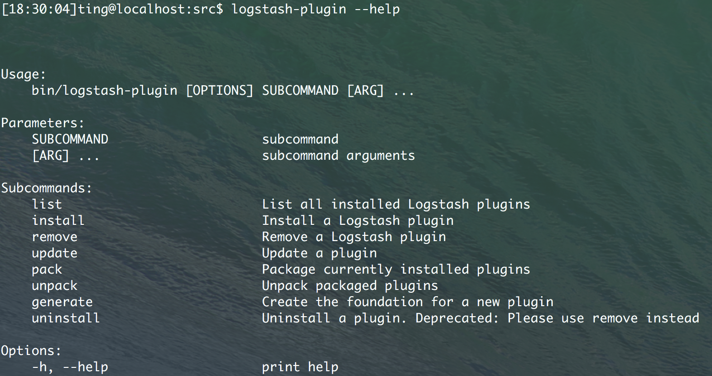

> 2016年12月15日 星期四 12时06分27秒 CST

# ELK stack 之 Logstash
Logstash 是用来收集日志的

## Logstash 配置语法
g 设计了自己的 DSL -- 类似于 Puppet 的 DSL (均是用 Ruby 写的)，包括有
section, comment, 数据类型(bool, string, numeric, array, hash), 条件判断, 字段引用等

### section `{}`
section 由 `{}`定义，section内可以包括插件的 section 定义, 可以在一个section内定义多个插件. 
插件 section 内可以定义 key-value 。比如
```Logstash
input {
  stdin {
  }
  syslog {
  }
}
```

### 数据类型
1. bool : `debug => true`
2. string : `host => "hostname"`
3. number: `port => 514`
4. array: `match => ["datetime", "unix", "ISO8601"]`
5. hash: 
```Logstash
options => {
  key1 => "value1",
  key2 => "value2"
}
```

### field reference
field 是 `g::Event` 对象的属性，事件其实类似于一个hash，field相当于其中的 key-value

对于嵌套字段（即多维哈希表，或者叫哈希的哈希）, 每层的字段名都写在 `[]`里就可以了。比如，从 geoip 里获取 longitude 值，
```loghash
[geoip][location][0]
```
注意，Logstash 的数组也支持倒叙下表，即 `[geoip][location[-1]`可以获取数组最后一个元素的值

Logstash 还支持变量内插，在字符串里使用字段引用的方法是这样的
```Logstash
"the longitude is %{[geoip][location][0]}"
```

### 条件判断
Logstash 1.3.0 版本以上支持条件判断和表达式
表达式支持下面这些操作符：
- `==, !=, <, >, <=, >=`
- `=~ (匹配正则), !~ (不匹配正则)`
- `in, not in`
- `and, or, nand, xor`
- `()`: 复合表达式，`!()`: 非复合表达式

比如：
```Logstash
if "_grokparsefailure" not in [tags] {

}else if [status] !~ /^2\d\d/ or ( [url] == "/noc.gif" nand [geoip][city] != "beijing" )

}else {
}
```

## 命令行参数
Logstash 提供了一个 shell 脚本叫 `logstash`, 查看用法说明：
```bash
$ logstash -h
```

支持如下参数：
- `-e`即execute, 
  比如：
```bash
# logstash -e 'input{stdin{}}output{stdout{codec=>rubydebug}}'
```
这个表示从终端读入数据, 然后生成生成的日志数据

- `--config` 或 `-f` 即文件. 用于指定配置文件。
  另外， 可以使用`logstash -f /etc/logstash.d` 来使得 logstash 自动读取 `/etc/logstash.d/`目录下的所有 `*.conf`文本文件，然后再在内存里拼接成一个完整的大配置文件.
注意， logstash 列出目录下所有文件时，是按字母排序的，而 logstash 配置段的 filter 和 output 都是顺序执行的，所以顺序非常重要。如果采用多文件管理，则推荐采用
按照数字编号方式命名配置文件，同时在配置中，严谨采用 if 判断限定不同日志的动作.

- `--configtest` 或者 `-t` 即测试。
- `--log` 或 `-l` 即日志
  Logstash 默认输出日志到标准错误，生产环境下可以通过 `logstash -l logs/logstash.log` 来统一存储日志
- `--pipeline-workers` 或 `-w` 指定运行 filter 和 output 的 pipeline 线程数量。默认是 CPU 核数。
- `--pipeline-batch-size` 或 `-b`
  每个 Logstash pipeline 线程， 在执行具体的 filter 和 output 函数之前， 最多能累积的日志条数。默认是125条。越大性能越好，但是会消耗相对较多的 JVM 内存
- `--pipeline-batch-delay` 或 `-u`
  每个Logstash pipeline worker 线程，在打包批量日志的时候，最多等待几毫秒，默认5ms
- `--pluginpath` 或 `-P`
  可以写自己的插件，然后用 `logstash --pluginpath /path/to/own/plugin` 加载它们
- `--verbose`
- `--debug`

## 设置文件
从 Logstash 5.0 开始，新增了 `$LS_HOME/config/logstash.yml` 文件，可以将所有的命令行参数都通过YAML文件方式设置。同时为了反映命令行配置参数的层级关系，
参数也都用.而不是-了。
```YAML
pipeline:
  workers: 24
  batch:
    size: 125
    delay: 5
```

## 插件的安装
从 Logstash 1.5.0 版本开始， Logstash 将所有的插件都独立拆分为 gem 包， 这样， 每个插件都可以独立更新，不用等到 Logstash 自身做整体更新的时候才能使用了。
为此，Logstash 配置了专门的 plugins 管理命令。

### plugin 用法说明
```bash
$ logstash-plugin -h
```

logstash-plugin 的命令格式如下：



首先，可以通过 `logstash-plugin list` 查看本机现在有多少插件可以用（在目录vendor/bundle/jruby/1.9/gems/ 下, Mac 如果用brew安装的话，则是/usr/local/Cellar/logstash/5.1.1/libexec/vendor/bundle/jruby/1.9/gems)

然后，如果看到 https://github.com/logstash-plugins/ 下新发布了一个 logstash-output-webhdfs 模块，打算试试，就只需要运行如下的命令就可以了
```bash
logstash-plugin install logstash-output-webhdfs
```

如果是要升级，则可以运行命令：
```bash
logstash-plugin update logstash-input-tcp
```

### 本地插件安装
logstash-plugin 命令不但可以通过 rubygems 平台安装插件，还可以读取本地路径的 gem 文件：
```bash
logstash-plugin install /path/to/logstash-filter-crash.gem
```
执行成功后，则 logstash-5.1.1 目录下的 Gemfile 文件会多出一段内容, 
```
gem "logstash-filter-crash", "1.1.0", :path => "vendor/local_gems/d354312c/logstash-filter-mweibocrash-1.1.0"
```
而 Gemfile.jruby-1.9.lock 文件头部也会多出一段内容
```
PATH
  remote: vendor/local_gems/d354312c/logstash-filter-crash-1.1.0
    specs:
        logstash-filter-crash (1.1.0)
        logstash-core (>= 1.4.0, < 2.0.0)
```

## 长期运行的方式
### 标准的 service 方式
推荐星级：⭐️⭐️⭐️⭐️⭐️

采用RPM/DEB发行包安装的Logstash，可以使用这种方式。发行包内，都自带有sysV 或者 systemd 风格的启动程序及配置，直接使用即可。

比如RPM安装包中，`/etc/init.d/logstash` 脚本中，会加载`/etc/init.d/functions`库文件，利用其中的`daemon`函数，将logstash进程作为后台程序运行。
所以，我们只要将写好的logstash配置文件，统一放在`/etc/logstash/conf.d`目录下即可，且不能包含其他非.conf文件。因为 logstash agent 启动的时候
是读取整个文件夹的，然后运行如下的命令即可：
```bash
service logstash start
```

### Daemontools 方式
推荐星级：⭐️⭐️⭐️⭐️⭐️


对于需要长期后台运行的大量程序，比如ELK集群，可以使用 daemontools工具。（不过如果只有一个进程，还是推荐学习写 SYSTEM V init Script, 采用 service 管理）

daemontools 是一个软件名称，这里指代整个同类产品，比如：

| daemontools 工具 | 实现语言 |
| ---              | ---      |
| supervisord      | python   |
| ubic             | perl     |
| god              | ruby     |


#### supervisord 
安装完supervisord后，在 /etc/supervisord.conf 配置文件中添加内容，定义要启动的程序（这里是 logstash）:

```conf
[program:elkpro_1]
environmont=LS_HEAP_SIZE=5000m
directory=/opt/logstash
command=/opt/logstash/bin/logstash -f /etc/logstash/pro1.conf -w 10 -l /var/log/logstash/prog1.log

[program:elkpro_2]
environmont=LS_HEAP_SIZE=5000m
directory=/opt/logstash
command=/opt/logstash/bin/logstash -f /etc/logstash/pro2.conf -w 10 -l /var/log/logstash/prog2.log

```

然后采用service 方式启动 supervisord 即可：
```bash
service supervisord start
```

logstash 会以 supervisord 子进程的身份运行。此外，还可以使用 `supervisorctl` 命令，单独控制一系列 logstash 子进程中的某个进程的启动停止操作：
```bash
superisorctl stop elkpro_2
```

### Screen 方式
推荐星级：⭐️⭐️⭐️

### Nohub 方式
推荐星级：⭐️


## 汇总
1. ELK stack 中文指南：http://kibana.logstash.es/content/logstash/get-start/hello-world.html
2. Logstash Reference 5.1 安装指南: https://www.elastic.co/guide/en/logstash/current/installing-logstash.html

